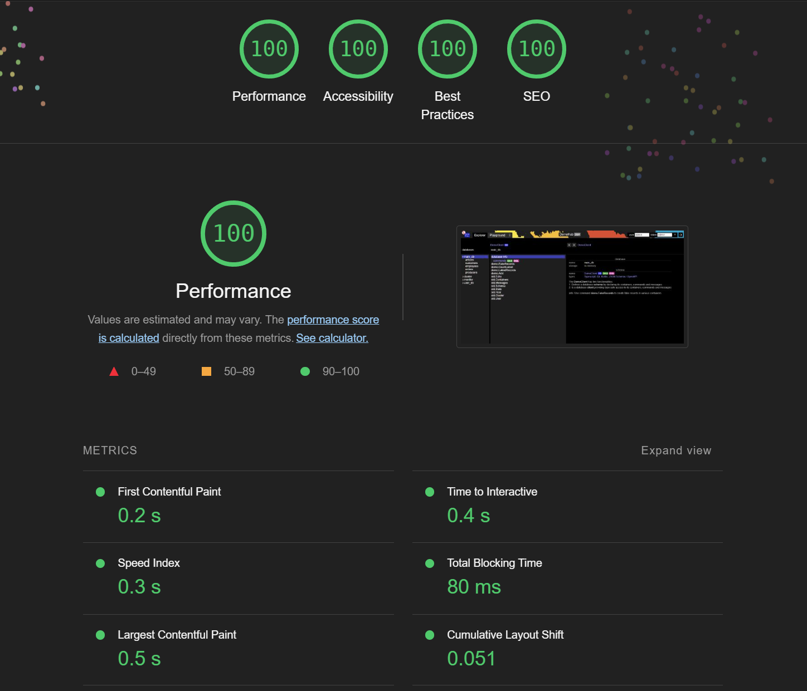

# [](https://github.com/friflo/Friflo.Json.Fliox)        **Hub Explorer** 


namespace **`Friflo.Json.Fliox.Hub.Explorer`**

This package contains an SPA - single page web application - used for development
and administration of databases hosted by a **Fliox Hub**.

The **Hub Explorer** enables:

1. browse databases, containers and entities.
2. view and edit JSON records with auto completion and instant validation using the database schema
3. display hover documentation of JSON properties defined in the database schema
4. mark properties defined as relations in the schema as links in the entity editor
5. execute container queries using a LINQ filter expression
6. execute standard or custom database commands. E.g. `std.Echo`
7. send batch requests via HTTP or WebSocket to the Fliox.Hub server using the **Playground**

As the **Hub Explorer** is optional it is distributed as a separate
**NuGet** package: **Friflo.Json.Fliox.Hub.Explorer**.

The static web files are added to the **HTTP Fliox Hub** by adding the root folder
available via the `HubExplorer.Path`

For integration to a **HTTP Fliox Hub** server call:

```csharp
     HttpHost httpHost;
     ...
     httpHost.AddHandler(new StaticFileHandler(HubExplorer.Path));
```


*screenshot: Fliox Hub Explorer*

## Explorer implementation

The Explorer is written in Typescript without using a third party UI library like React of Vue.js to avoid external dependencies.

It utilizes the [Monaco Editor](https://microsoft.github.io/monaco-editor/) on various places to view & edit JSON.
All integrated editors are using the **JSON Schemas** exposed by Hub.
This enables auto completion and instant validation of JSON values.
Validation errors are marked as warnings by yellow wavy underlines directly in the editors.

## Performance

The goal - when opening or refreshing the Hub Explorer - is being instantaneously available to the user.  
Almost all Hub responses can be cached so that a subsequent page load performs only two requests to the Hub.  
Below a screenshot of a **Lighthouse Performance** report measured by Chrome DevTools on localhost.

When browsing databases, containers, their entities or executing database commands the `/fliox/rest` API is used.  
In case of using an `in-memory` database on localhost the expected execution time of a typical request is **1 ms**
at DevTools > Network > Time.  


*screenshot: Chrome Lighthouse report of Hub Explorer*
